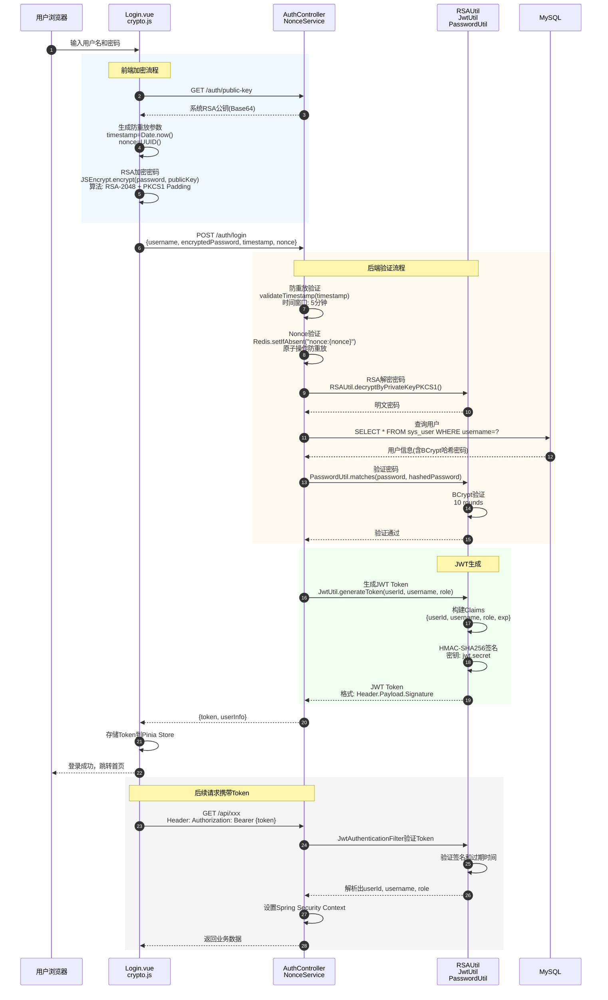
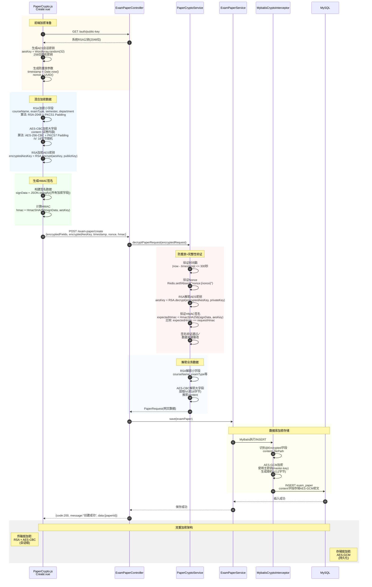

# 试卷审批系统 - 密码学技术流程图

> 本文档展示系统中5个核心密码学技术的详细实现流程

---

## 1. 用户认证流程（JWT + RSA + BCrypt）

### 流程图



### 关键点说明

**涉及的密码学算法:**
- **RSA-2048**: 登录密码加密传输，PKCS1 Padding
- **BCrypt**: 密码存储，10轮迭代，自动加盐
- **HMAC-SHA256**: JWT Token签名，防篡改

**安全特性:**
- 防重放攻击：timestamp时间窗口（5分钟）+ Redis原子nonce验证
- 密码不明文传输：RSA公钥加密
- 无状态认证：JWT携带用户信息，无需服务端session

**核心文件:**
- 前端: `Login.vue:114-150`, `crypto.js:336-423`
- 后端: `AuthController.java:50-123`, `JwtUtil.java:56-74`, `NonceService.java:50-119`

---

## 2. 数据库透明加密流程（AES-256-GCM + MyBatis拦截器）

### 2.1 插入/更新加密流程

```mermaid
flowchart TD
    Start([Service层调用<br/>examPaperService.save-paper-]) --> Invoke[MyBatis执行SQL]

    Invoke --> Intercept1{MybatisCryptoInterceptor<br/>拦截ParameterHandler.setParameters}

    Intercept1 -->|拦截到| GetParam[获取参数对象<br/>parameterObject]

    GetParam --> CheckType{检查对象类型}

    CheckType -->|Map类型<br/>如ParamMap| RecurseMap[递归处理Map.values]
    RecurseMap --> GetParam

    CheckType -->|实体对象<br/>如ExamPaper| Reflect[反射获取所有字段<br/>Field- fields = clazz.getDeclaredFields]

    Reflect --> FindAnnotation{查找@Encrypted注解}

    FindAnnotation -->|找到| GetValue[获取字段值<br/>field.get-obj-]

    GetValue --> CheckEncrypted{isEncrypted-value-?<br/>判断是否已加密}

    CheckEncrypted -->|长度<16字符| Plain[明文，需要加密]
    CheckEncrypted -->|非Base64格式| Plain
    CheckEncrypted -->|长度<39字符| Plain
    CheckEncrypted -->|Base64解码<29字节| Plain
    CheckEncrypted -->|符合AES-GCM格式| Encrypted[已加密，跳过]

    Plain --> AESEncrypt[AES-GCM加密]

    AESEncrypt --> Step1[生成随机IV-12字节-<br/>SecureRandom.nextBytes-iv-]
    Step1 --> Step2[初始化Cipher<br/>AES/GCM/NoPadding<br/>GCMParameterSpec-128, iv-]
    Step2 --> Step3[加密<br/>cipher.doFinal-plainText.getBytes-]
    Step3 --> Step4[拼接结构<br/>IV-12字节- + 密文 + Tag-16字节-]
    Step4 --> Step5[Base64编码<br/>Base64.encode-combined-]

    Step5 --> SetField[更新字段值<br/>field.set-obj, encrypted-]

    Encrypted --> FindAnnotation
    SetField --> FindAnnotation

    FindAnnotation -->|无更多@Encrypted字段| Proceed[继续执行SQL<br/>invocation.proceed]

    Proceed --> DBInsert[(插入数据库<br/>content字段存储密文)]

    DBInsert --> End([完成])

    style AESEncrypt fill:#ffcccc
    style Step1 fill:#ffcccc
    style Step2 fill:#ffcccc
    style Step3 fill:#ffcccc
    style Step4 fill:#ffcccc
    style Step5 fill:#ffcccc
    style DBInsert fill:#cce5ff
```

### 2.2 查询解密流程

```mermaid
flowchart TD
    Start([Service层调用<br/>examPaperService.getById-id-]) --> Query[(执行SQL查询<br/>SELECT * FROM exam_paper WHERE id=?)]

    Query --> Intercept2{MybatisCryptoInterceptor<br/>拦截ResultSetHandler.handleResultSets}

    Intercept2 -->|拦截到| GetResult[获取查询结果<br/>List<?> result]

    GetResult --> Loop{遍历结果集}

    Loop -->|每条记录| Reflect[反射获取所有字段]

    Reflect --> FindAnnotation{查找@Encrypted注解}

    FindAnnotation -->|找到| GetEncValue[获取字段值<br/>field.get-obj-]

    GetEncValue --> CheckEnc{isEncrypted-value-?}

    CheckEnc -->|不是密文<br/>如明文"test"| Skip[跳过解密<br/>避免解密明文数据]

    CheckEnc -->|是密文<br/>符合AES-GCM格式| AESDecrypt[AES-GCM解密]

    AESDecrypt --> DStep1[Base64解码<br/>byte- data = Base64.decode-cipherText-]
    DStep1 --> DStep2[提取IV<br/>byte- iv = data-0..12-]
    DStep2 --> DStep3[提取密文+Tag<br/>byte- encrypted = data-12..end-]
    DStep3 --> DStep4[初始化Cipher<br/>AES/GCM/NoPadding<br/>GCMParameterSpec-128, iv-]
    DStep4 --> DStep5[解密并验证Tag<br/>cipher.doFinal-encrypted-<br/>GCM自动验证认证标签]
    DStep5 --> DStep6{Tag验证}

    DStep6 -->|验证通过| DStep7[返回明文<br/>new String-decrypted, UTF_8-]
    DStep6 -->|验证失败<br/>数据被篡改| Error[抛出异常<br/>AEADBadTagException]

    DStep7 --> SetDecField[更新字段值<br/>field.set-obj, decrypted-]

    Skip --> FindAnnotation
    SetDecField --> FindAnnotation
    Error --> End2([解密失败])

    FindAnnotation -->|无更多@Encrypted字段| Loop

    Loop -->|遍历完成| Return[返回解密后的结果集]

    Return --> End([Service层获得明文数据])

    style AESDecrypt fill:#ccffcc
    style DStep1 fill:#ccffcc
    style DStep2 fill:#ccffcc
    style DStep3 fill:#ccffcc
    style DStep4 fill:#ccffcc
    style DStep5 fill:#ccffcc
    style DStep6 fill:#ccffcc
    style DStep7 fill:#ccffcc
    style Query fill:#cce5ff
    style Error fill:#ffcccc
```

### 关键点说明

**AES-GCM加密参数:**
- **密钥长度**: 256位（32字节）
- **IV长度**: 12字节（96位，GCM推荐）
- **认证标签**: 128位（16字节）
- **编码格式**: IV(12) + 密文 + Tag(16) → Base64

**透明加密特性:**
- Service层无需关心加密逻辑，操作明文数据
- `@Encrypted`注解声明式标记需要加密的字段
- 自动判断数据是否已加密，避免重复加密/解密明文

**安全保障:**
- GCM模式提供认证加密（AEAD），自动防篡改
- 每次加密使用随机IV，相同明文生成不同密文
- Tag验证失败自动抛出异常，防止数据被篡改

**核心文件:**
- `MybatisCryptoInterceptor.java:74-219`
- `AESUtil.java:61-92` (加密), `AESUtil.java:105-141` (解密)
- `ExamPaper.java:46-53` (@Encrypted注解使用示例)

---

## 3. API传输加密流程（RSA密钥交换 + AES-CBC + HMAC）

### 流程图



### 关键点说明

**双重加密架构:**
1. **传输层加密** (前端 → 后端):
   - 小字段: RSA-2048加密
   - 大字段: AES-256-CBC加密（会话密钥）
   - 会话密钥: RSA加密后传输
   - 完整性: HMAC-SHA256签名

2. **存储层加密** (后端 → 数据库):
   - 敏感字段: AES-256-GCM加密（主密钥）
   - 透明加密: MyBatis拦截器自动处理

**为什么需要双重加密?**
- **传输层**: 防止网络窃听，前后端密钥协商
- **存储层**: 防止数据库泄露，数据持久化保护
- **解耦**: 传输层密钥单次会话有效，存储层密钥长期使用

**混合加密优势:**
- RSA加密小数据（字段名、类型等）
- AES加密大数据（试卷内容，性能优）
- RSA传输AES密钥（结合两者优点）

**核心文件:**
- 前端: `crypto.js:429-566`, `Create.vue`
- 后端: `PaperCryptoService.java:40-102`, `ExamPaperController.java`
- 拦截器: `MybatisCryptoInterceptor.java`

---

## 4. 审批数字签名流程（RSA-2048 + SHA256withRSA）

### 4.1 签名生成流程

```mermaid
flowchart TD
    Start([管理员点击"通过"按钮]) --> Controller[ApprovalController<br/>approve-paperId, approverId, comment-]

    Controller --> Service[ApprovalService.approve]

    Service --> CheckAuth{权限验证}
    CheckAuth -->|currentStep=1| CheckDept{是否系管理员?}
    CheckAuth -->|currentStep=2| CheckCollege{是否院管理员?}
    CheckDept -->|否| AuthFail[权限不足]
    CheckCollege -->|否| AuthFail
    CheckDept -->|是| BuildSign[构建签名数据]
    CheckCollege -->|是| BuildSign

    BuildSign --> SignData["signData = buildApprovalSignData()<br/>格式: paper={paperId}&approver={approverId}<br/>&action={action}&comment={comment}<br/>&timestamp={timestamp}"]

    SignData --> GetPrivateKey[获取审批人私钥<br/>getPrivateKeyForUser-approverId, password-]

    GetPrivateKey --> LoadKey{私钥来源}
    LoadKey -->|理想方案| DBQuery[(查询encryption_key表<br/>获取加密存储的私钥<br/>用密码解密)]
    LoadKey -->|当前演示| TempGen[临时生成密钥对<br/>KeyPairGenerator.generateKeyPair]

    DBQuery --> DecryptKey[用户密码解密私钥]
    DecryptKey --> PrivateKey[得到RSA私钥]
    TempGen --> PrivateKey

    PrivateKey --> RSASign[RSA数字签名]

    RSASign --> SStep1[解析私钥<br/>PKCS8EncodedKeySpec<br/>KeyFactory.generatePrivate]
    SStep1 --> SStep2[初始化签名对象<br/>Signature.getInstance-'SHA256withRSA'-]
    SStep2 --> SStep3[加载私钥<br/>signature.initSign-privateKey-]
    SStep3 --> SStep4[更新待签名数据<br/>signature.update-signData.getBytes-]
    SStep4 --> SStep5[计算签名<br/>signBytes = signature.sign<br/>内部流程:<br/>1. SHA-256哈希signData → H<br/>2. 用私钥加密H → signature]
    SStep5 --> SStep6[Base64编码<br/>Base64.encode-signBytes-]

    SStep6 --> SaveRecord[保存审批记录]

    SaveRecord --> CreateRecord["ApprovalRecord.builder()<br/>.paperId-paperId-<br/>.approverId-approverId-<br/>.action-'approve'-<br/>.comment-comment-  // @Encrypted<br/>.signature-signature-  // 不加密<br/>.build()"]

    CreateRecord --> DBInsert[(INSERT INTO approval_record)]

    DBInsert --> UpdateWorkflow[更新工作流状态<br/>currentStep++<br/>status: pending/completed]

    UpdateWorkflow --> End([审批完成])

    AuthFail --> Error([拒绝访问])

    style RSASign fill:#ffcccc
    style SStep1 fill:#ffcccc
    style SStep2 fill:#ffcccc
    style SStep3 fill:#ffcccc
    style SStep4 fill:#ffcccc
    style SStep5 fill:#ffcccc
    style SStep6 fill:#ffcccc
    style DBInsert fill:#cce5ff
```

### 4.2 签名验证流程

```mermaid
flowchart TD
    Start([查看审批历史<br/>验证签名真实性]) --> Query[(查询审批记录<br/>SELECT * FROM approval_record<br/>WHERE id=?)]

    Query --> GetRecord[获取审批记录<br/>paperId, approverId, action,<br/>comment, signature, createTime]

    GetRecord --> RebuildSign[重建签名数据]

    RebuildSign --> ExtractTime[提取时间戳<br/>timestamp = createTime<br/>.toInstant-ZoneOffset.ofHours-8--<br/>.toEpochMilli]

    ExtractTime --> BuildData["signData = buildApprovalSignData()<br/>使用相同格式:<br/>paper={paperId}&approver={approverId}<br/>&action={action}&comment={comment}<br/>&timestamp={timestamp}"]

    BuildData --> GetPublicKey[获取审批人公钥<br/>getPublicKeyForUser-approverId-]

    GetPublicKey --> LoadPubKey{公钥来源}
    LoadPubKey -->|理想方案| DBQueryPub[(查询encryption_key表<br/>获取公钥-可公开-)]
    LoadPubKey -->|当前演示| TempGenPub[使用临时生成的公钥]

    DBQueryPub --> PublicKey[得到RSA公钥]
    TempGenPub --> PublicKey

    PublicKey --> RSAVerify[RSA签名验证]

    RSAVerify --> VStep1[解析公钥<br/>X509EncodedKeySpec<br/>KeyFactory.generatePublic]
    VStep1 --> VStep2[初始化验证对象<br/>Signature.getInstance-'SHA256withRSA'-]
    VStep2 --> VStep3[加载公钥<br/>signature.initVerify-publicKey-]
    VStep3 --> VStep4[更新待验证数据<br/>signature.update-signData.getBytes-]
    VStep4 --> VStep5[Base64解码签名<br/>signBytes = Base64.decode-signatureStr-]
    VStep5 --> VStep6["验证签名<br/>boolean result = signature.verify-signBytes-<br/>内部流程:<br/>1. 用公钥解密signature → H1<br/>2. SHA-256哈希signData → H2<br/>3. 比较H1 == H2"]

    VStep6 --> CheckResult{验证结果}

    CheckResult -->|true| Valid[✓ 签名有效<br/>1. 确实由审批人签署<br/>2. 数据未被篡改<br/>3. 不可抵赖]
    CheckResult -->|false| Invalid[✗ 签名无效<br/>可能原因:<br/>1. 签名被篡改<br/>2. 数据被修改<br/>3. 使用了错误的公钥]

    Valid --> Display[显示审批详情<br/>标记"已验证✓"]
    Invalid --> Warning[显示警告<br/>"签名验证失败，数据可能被篡改"]

    Display --> End([完成])
    Warning --> End

    style RSAVerify fill:#ccffcc
    style VStep1 fill:#ccffcc
    style VStep2 fill:#ccffcc
    style VStep3 fill:#ccffcc
    style VStep4 fill:#ccffcc
    style VStep5 fill:#ccffcc
    style VStep6 fill:#ccffcc
    style Valid fill:#ccffcc
    style Invalid fill:#ffcccc
    style Query fill:#cce5ff
```

### 关键点说明

**数字签名原理:**
- **签名生成**: Hash(data) → 私钥加密 → Signature
- **签名验证**: 公钥解密Signature → Hash1，Hash(data) → Hash2，比较Hash1 == Hash2

**不可抵赖性保障:**
1. **唯一性**: 每个审批人有独立的RSA密钥对，私钥唯一
2. **不可伪造**: 没有私钥无法生成有效签名
3. **可验证**: 任何人用公钥都能验证签名真实性
4. **时间戳**: 签名包含时间戳，证明签署时间
5. **完整性**: 数据被篡改会导致验证失败

**签名数据格式:**
```
paper=1001&approver=2001&action=approve&comment=同意通过&timestamp=1731801234567
```

**安全考虑:**
- 私钥应加密存储在数据库（使用用户密码加密）
- 审批时需要输入密码解密私钥（二次验证）
- 公钥可公开存储，用于任何人验证

**核心文件:**
- `ApprovalService.java:68-133` (签名生成)
- `ApprovalService.java:198-222` (签名验证)
- `RSAUtil.java:150-210` (RSA签名/验签工具)
- `ApprovalRecord.java:59-62` (@Encrypted comment, signature字段)

---

## 5. 防重放攻击流程（Nonce + Timestamp + Redis）

### 流程图

```mermaid
flowchart TD
    Start([客户端发起请求]) --> GenParams[生成防重放参数]

    GenParams --> GenTime[生成时间戳<br/>timestamp = Date.now<br/>例: 1731801234567 -毫秒-]

    GenTime --> GenNonce[生成随机Nonce<br/>nonce = UUID.v4<br/>例: 'a1b2c3d4-e5f6-7890-abcd-ef1234567890']

    GenNonce --> SendReq[发送请求<br/>携带timestamp和nonce]

    SendReq --> Backend[后端接收请求]

    Backend --> ValidateService[NonceService.validate-timestamp, nonce-]

    ValidateService --> CheckTime[验证时间戳]

    CheckTime --> CalcDiff[计算时间差<br/>currentTime = System.currentTimeMillis<br/>diff = |currentTime - timestamp|]

    CalcDiff --> CompareWindow{diff <= timeWindow?<br/>默认: 300000ms -5分钟-}

    CompareWindow -->|否<br/>请求过期| TimeExpired[时间窗口验证失败<br/>可能原因:<br/>1. 请求发送时间过早<br/>2. 网络延迟过大<br/>3. 客户端时钟不准]

    CompareWindow -->|是<br/>时间有效| CheckNonce[验证Nonce]

    CheckNonce --> BuildKey[构建Redis Key<br/>key = 'nonce:{nonce}'<br/>例: 'nonce:a1b2c3d4-e5f6-7890-abcd-ef1234567890']

    BuildKey --> RedisOp[Redis原子操作<br/>SETNX]

    RedisOp --> SetIfAbsent["redisTemplate.opsForValue()<br/>.setIfAbsent-key, timestamp, TTL-<br/>TTL = 300000ms"]

    SetIfAbsent --> RedisCheck{Redis返回值?}

    RedisCheck -->|true<br/>SET成功<br/>key不存在| FirstUse[✓ 首次使用<br/>Nonce有效]
    RedisCheck -->|false<br/>SET失败<br/>key已存在| ReplayDetected[✗ Nonce已使用<br/>检测到重放攻击!]

    FirstUse --> SetTTL[设置过期时间<br/>TTL = 5分钟<br/>防止Redis内存溢出]

    SetTTL --> ValidResult[返回验证通过]

    ValidResult --> ProcessReq[处理业务逻辑<br/>登录/创建试卷/审批]

    ProcessReq --> Response[返回响应]

    TimeExpired --> Reject[拒绝请求<br/>返回错误:<br/>'请求已过期']
    ReplayDetected --> Reject

    Reject --> End([请求被拒绝])
    Response --> End2([请求成功])

    rect rgb(255, 245, 245)
        Note over RedisOp,SetTTL: Redis原子性保障<br/>SETNX命令是原子操作<br/>并发请求中只有一个能成功
    end

    rect rgb(245, 255, 245)
        Note over SetTTL: 自动清理机制<br/>5分钟后Redis自动删除<br/>该Nonce可再次使用<br/>-但时间戳已失效-
    end

    style RedisOp fill:#cce5ff
    style SetIfAbsent fill:#cce5ff
    style FirstUse fill:#ccffcc
    style ReplayDetected fill:#ffcccc
    style TimeExpired fill:#ffcccc
    style ValidResult fill:#ccffcc
```

### Redis数据结构示例

```redis
# 首次请求成功后，Redis存储:
127.0.0.1:6379> GET "nonce:a1b2c3d4-e5f6-7890-abcd-ef1234567890"
"1731801234567"

127.0.0.1:6379> TTL "nonce:a1b2c3d4-e5f6-7890-abcd-ef1234567890"
(integer) 287  # 剩余287秒

# 重放攻击尝试:
127.0.0.1:6379> SETNX "nonce:a1b2c3d4-e5f6-7890-abcd-ef1234567890" "1731801235000"
(integer) 0  # 返回0，SET失败，检测到重放

# 5分钟后自动过期:
127.0.0.1:6379> GET "nonce:a1b2c3d4-e5f6-7890-abcd-ef1234567890"
(nil)  # Key已过期删除
```

### 关键点说明

**双重防护机制:**
1. **时间戳验证**:
   - 防止过早或过晚的请求
   - 时间窗口: 5分钟（可配置）
   - 客户端时钟同步要求: ±5分钟

2. **Nonce验证**:
   - 防止相同请求重复提交
   - Redis原子操作保障并发安全
   - 自动过期清理（TTL=5分钟）

**为什么需要两层验证?**
- **仅时间戳**: 攻击者可在5分钟内重放
- **仅Nonce**: 攻击者可延迟很久后重放
- **组合**: 既防止重放，又限制时间窗口

**Redis SETNX原子性:**
```java
// SETNX = SET if Not eXists
Boolean success = redisTemplate.opsForValue()
    .setIfAbsent(key, value, timeout, TimeUnit.MILLISECONDS);

// 原子性保障:
// - 检查key是否存在
// - 不存在则SET，返回true
// - 已存在则跳过，返回false
// - 整个过程不可分割，线程安全
```

**应用场景:**
- 登录请求 (`AuthController.java`)
- 试卷创建 (`PaperCryptoService.java`)
- 重要操作（转账、审批等）

**配置:**
- `application.yml`: `security.replay-time-window: 300000`

**核心文件:**
- `NonceService.java:50-119`
- `RedisConfig.java` (Redis配置)

---

## 总结：密码学技术综合应用

### 技术栈总览

| 技术 | 算法/协议 | 密钥长度 | 应用场景 | 安全特性 |
|------|----------|---------|---------|---------|
| **对称加密** | AES-256-GCM | 256位 | 数据库字段加密 | 认证加密(AEAD)、防篡改 |
| | AES-256-CBC | 256位 | API传输加密 | 高性能、大数据加密 |
| **非对称加密** | RSA-2048 | 2048位 | 密码加密、密钥交换 | 公钥加密、私钥解密 |
| **数字签名** | RSA + SHA-256 | 2048位 | 审批签名 | 不可抵赖、可验证 |
| **哈希算法** | BCrypt | - | 密码存储 | 自动加盐、防彩虹表 |
| | HMAC-SHA256 | 256位 | 数据完整性 | 防篡改 |
| **身份认证** | JWT | 256位 | 无状态认证 | HMAC签名、防篡改 |
| **防重放** | UUID + Timestamp + Redis | - | 重放攻击防护 | 时间窗口+原子操作 |

### 安全架构层次

```
┌─────────────────────────────────────────────────────┐
│               前端 (Vue 3 + CryptoJS)                │
│  ┌─────────────────────────────────────────────┐   │
│  │  RSA加密密码  │  AES-CBC加密数据  │  HMAC签名 │   │
│  └─────────────────────────────────────────────┘   │
└─────────────────────┬───────────────────────────────┘
                      │ HTTPS传输
                      ▼
┌─────────────────────────────────────────────────────┐
│              后端 (Spring Boot)                      │
│  ┌─────────────────────────────────────────────┐   │
│  │  JWT验证  │  RSA解密  │  AES解密  │  HMAC验证  │   │
│  └─────────────────────────────────────────────┘   │
│  ┌─────────────────────────────────────────────┐   │
│  │  防重放攻击(Redis Nonce)  │  权限控制(RBAC)   │   │
│  └─────────────────────────────────────────────┘   │
│  ┌─────────────────────────────────────────────┐   │
│  │  MyBatis拦截器 (AES-GCM透明加密)              │   │
│  └─────────────────────────────────────────────┘   │
└─────────────────────┬───────────────────────────────┘
                      │ JDBC加密连接
                      ▼
┌─────────────────────────────────────────────────────┐
│              数据库 (MySQL)                          │
│  ┌─────────────────────────────────────────────┐   │
│  │  AES-GCM加密字段  │  BCrypt密码哈希           │   │
│  │  RSA签名存储      │  审计日志                 │   │
│  └─────────────────────────────────────────────┘   │
└─────────────────────────────────────────────────────┘
```

### 纵深防御策略

1. **传输层**: HTTPS + RSA密钥交换 + AES会话加密
2. **应用层**: JWT认证 + RBAC权限 + 防重放攻击
3. **业务层**: 数字签名 + HMAC完整性验证
4. **数据层**: AES-GCM透明加密 + BCrypt密码哈希

---

**文档版本**: v1.0
**最后更新**: 2025-11-17
**作者**: 网络信息安全大作业
**相关文档**: [README.md](../README.md), [完整开发指南.md](完整开发指南.md)
